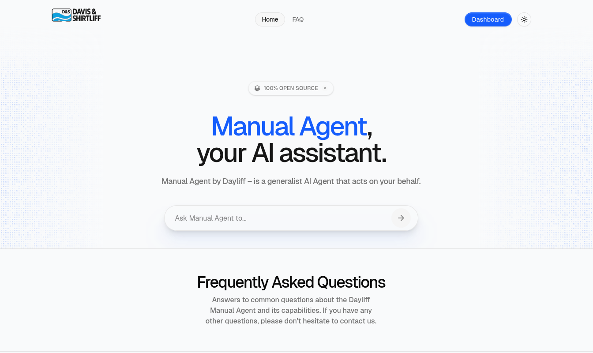

<div align="center">

# Manual Agent - AI-Powered Technical Documentation Assistant

(Your intelligent documentation companion)



Manual Agent is an advanced AI-powered system that revolutionizes how you interact with technical documentation and product manuals. Through natural conversation, it helps you navigate complex technical documentation while leveraging powerful automation capabilities for comprehensive document management and analysis.

Manual Agent combines powerful PDF processing, intelligent search, and automation capabilities with an intuitive interface that understands what you need and delivers results efficiently.

[](./license)
[](https://github.com/kooya3/manuals/issues)

</div>

## Table of Contents

- [System Architecture](#system-architecture)
  - [Backend API](#backend-api)
  - [Frontend](#frontend)
  - [Agent Environment](#agent-environment)
  - [Document Processing](#document-processing)
  - [Database](#database)
- [Features](#features)
- [Use Cases](#use-cases)
- [Self-Hosting](#self-hosting)
- [Contributing](#contributing)
- [License](#license)

## System Architecture

(


Manual Agent consists of five integrated components:

### Backend API

Python/FastAPI service that handles:
- REST endpoints for manual management
- PDF processing and text extraction
- Thread management for conversations
- LLM integration (Anthropic, OpenAI) for intelligent processing
- Advanced search and indexing capabilities
- API integration for extended functionality

### Frontend

Modern Next.js/React application featuring:
- Responsive chat interface
- Manual browsing dashboard
- Advanced search functionality
- Real-time updates
- Document preview and navigation
- User management interface

### Agent Environment

Isolated execution environment providing:
- Secure document processing
- PDF manipulation and analysis
- Code interpretation for automation
- File system access with security controls
- Tool integration for extended capabilities
- Browser automation for web-based manuals

### Document Processing

Specialized system for manual management:
- PDF text extraction and indexing
- Metadata management and organization
- Content search and retrieval
- Version control for manuals
- Automatic backup system
- OCR for scanned documents
- Cross-referencing capabilities

### Database

Robust data management system handling:
- Manual storage and versioning
- Search indexing
- User authentication
- Access control
- Analytics
- Real-time updates
- Conversation history
- File metadata

## Features

1. **Cloud-based Manual Storage**: 
   - Secure storage and backup
   - Version control
   - Automatic synchronization

2. **Intelligent Search**:
   - Full-text search across all manuals
   - Context-aware results
   - Product-specific filtering
   - Metadata-based search

3. **Content Processing**:
   - PDF text extraction
   - OCR for scanned documents
   - Content structuring
   - Cross-referencing

4. **Access Control**:
   - User management
   - Role-based permissions
   - Activity logging
   - Usage analytics

5. **Integration Capabilities**:
   - API access
   - External system integration
   - Custom tool support
   - Automation workflows

## Use Cases

1. **Technical Documentation Search**: 
   - _"Find all installation instructions for Dayliff XL-5000 pump series"_
   - _"Show me maintenance schedules for all 4SR series pumps"_
   - _"Search across manuals and generate an HTML report of all pressure switch settings"_

2. **Product Information Extraction**:
   - _"Extract specifications for the Aquasmart 45 and display them in a web view"_
   - _"Compare technical details between 6SR12 and 6SR18 models and create an interactive comparison table"_
   - _"Generate a searchable HTML catalog of all pump specifications"_

3. **Manual Management**:
   - _"Upload and index new product manuals"_
   - _"Track manual versions and updates"_
   - _"Create a web-based manual viewer with search highlighting"_

4. **Cross-Reference Analysis**:
   - _"Find all products sharing similar maintenance procedures"_
   - _"Identify common parts across pump series"_
   - _"Generate an interactive dependency graph of compatible parts"_

5. **Web Research Integration**:
   - _"Search for updated specifications of the XL-5000 series online and compare with our manual"_
   - _"Find and compile user reviews and common issues from technical forums"_
   - _"Create a report combining manual data with online troubleshooting guides"_

6. **Code Generation and Documentation**:
   - _"Generate a Python script to parse maintenance schedules from all pump manuals"_
   - _"Create an HTML template for standardized manual presentations"_
   - _"Build a JavaScript tool for interactive manual navigation"_

7. **Interactive Documentation**:
   - _"Convert the pump selection guide into an interactive web tool"_
   - _"Create an animated installation guide using manual diagrams"_
   - _"Generate a responsive FAQ page from common issues across manuals"_

8. **Report Generation**:
   - _"Create a comprehensive HTML report of all pump efficiency curves"_
   - _"Generate a printable maintenance checklist with QR codes linking to detailed instructions"_
   - _"Build an interactive troubleshooting guide combining manual content and web resources"_

9. **API and Integration**:
   - _"Create an API endpoint for accessing pump specifications"_
   - _"Build a webhook integration for manual updates"_
   - _"Generate SDK documentation from manual specifications"_

10. **Visual Documentation**:
    - _"Extract and enhance technical diagrams from manuals"_
    - _"Create an interactive 3D parts viewer using manual specifications"_
    - _"Generate animated maintenance procedures from manual instructions"_

## Self-Hosting

Manual Agent can be self-hosted using our setup wizard. The process includes:

- Database and storage setup
- PDF processing configuration
- Search index initialization
- Security configuration
- API integration setup

### Quick Start

1. **Clone the repository**:
```bash
git clone https://github.com/davis-shirtliff/manual-agent.git
cd manual-agent
```

2. **Run setup**:
```bash
python setup.py
```

3. **Start services**:
```bash
python start.py
```

## Technologies

- [PDF.js](https://mozilla.github.io/pdf.js/) - PDF processing
- [Tesseract](https://github.com/tesseract-ocr/tesseract) - OCR capabilities
- [FastAPI](https://fastapi.tiangolo.com/) - Backend framework
- [Next.js](https://nextjs.org/) - Frontend framework
- [Supabase](https://supabase.com/) - Database and storage
- [Redis](https://redis.io/) - Caching and session management
- [OpenAI](https://openai.com/) - LLM processing
- [Anthropic](https://www.anthropic.com/) - Advanced text analysis

## License

Manual Agent is licensed under the Apache License, Version 2.0. See [LICENSE](./LICENSE) for the full license text.
